# Dungeons & Ale

Dungeons & Ale is a website for a fictional board game bar in Malmö Sweden. The bar specialises in offering a wide variety of board games, craft beers and events such as board game tournaments. The purpose of the website is to create an online presence for the bar, as well as providing information about what games are available, uppcoming events and the ability to book a table. 

The website will be useful for new customers who are curious about what kind of games and events that are available, as well as existing customers who wants to book a table. 

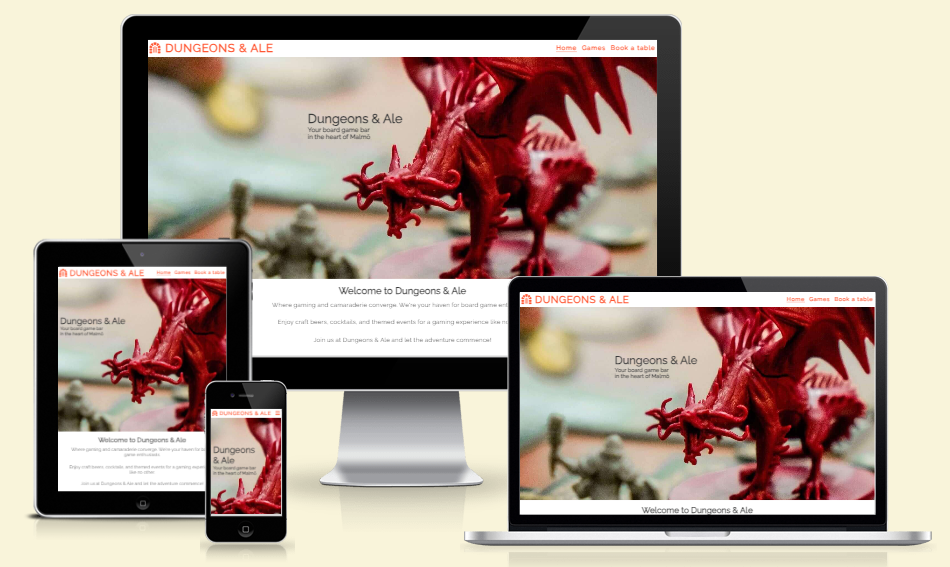

## Table of contents

- [User experience](#user-experience)
- [Features](#features)
- [Planning and design](#planning-and-design)
- [Technologies and languages uses](#technologies-and-languages-used)
- [Testing](#testing)
- [Deployment](#deployment)
- [Credits](#credits)

# User experience

### As user of the website

- Find out the location of the bar
- Learn about what kinds of games that are available
- Find out the opening hours
- Be able to book a table 

### As a owner of the bar/website

- Create an online presence for the bar
- Offer information on what type of games that are available
- Inform customers about location and opening hours
- Provide an opportunity to book a table 
- Inform customers about upcoming events 

# Features 

## Existing features

### Navigation bar

- The navigation bar contains a logo to the left, picturing a door to a dungeon, the name of the bar and on smaller screens (up to 768px) a "burger" menu to the right. Clicking the the "burger" menu toggles a menu of links to the home page, games page and book a table page. To make the navigation bar responsive, on screens bigger than 768px the links are placed by convention to the right for the user. The logo and menu links also increases in size as the screensize increases. The navigation bar is visible on all three pages.
- To show when a user is on a page, the page link underlines then the page is active. To indicate where the user are on the site. 
- When the mouse hovers over a page link, the page link underlines to indicate to the user that it is a link. 

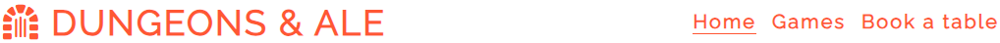
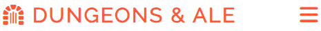

### Hero Image
- The home page contains a background image with a cover text, that together clearly states the purpose of the business and what type of establishment it is. The image is chosen to to convey a playfullness and appeal to potential customers. 

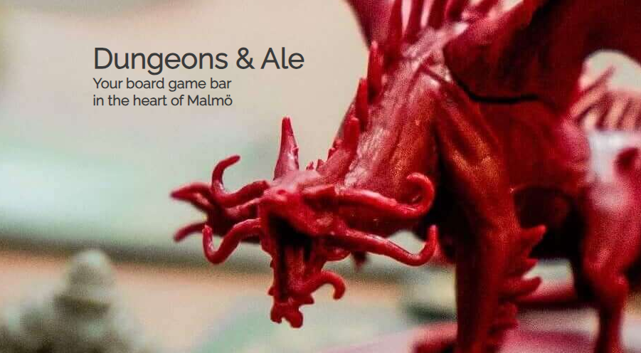

### Footer
- The footer is visible on all three pages. It contains three parts of information regarding opening hours, address and links to social media via icons. 
- It is made responsive to bigger screens by displaying the information in a horizontal row instead of a vertical column on screens bigger than 996px. 
- It is separated from the rest of the content by a border line in the same color as the logo and menu. 

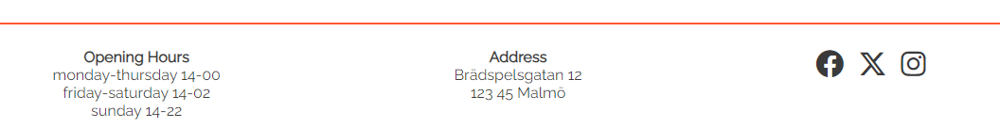

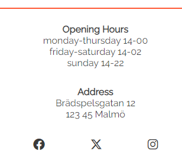

### Background images
- Both the games page and the book a table page contains a background image of the same size, to offer a consistent design and make it easy for the user to navigate. 

### Games page 
- The games page consist of three sections, the background image at the top, our collection of games in the middle and lastly a section with a list of uppcoming events. 
- Our collection of games consist of a list of different type of games that are available at the bar and a short text regarding the collection. 
- Uppcoming events consist of a list of uppcoming events, with information on what games they are related to as well as information on the date and starting time. 
- The games page is responsive, the events boxes stack vertically on smaller screens and move over to a horizontal line on bigger screens. The list of different type of games and the accompanying text move to the left and right respectively on bigger screens as well. 

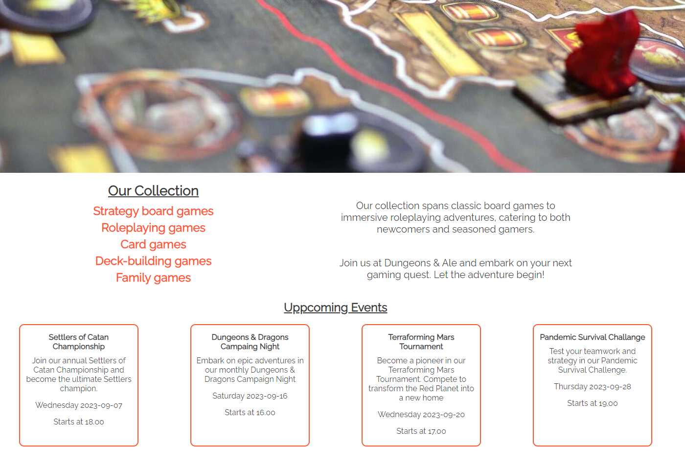

### Book a table page 
- The book a table page contains a form for booking a table, where the user fills in their full name, email address and specifies the number of guest, with a maximum of 8 people. All fields are required. The form increases in size on bigger screens as well as increasing the margin to the sides to keep it centered. Below the form is the contact information for users who have other questions. 

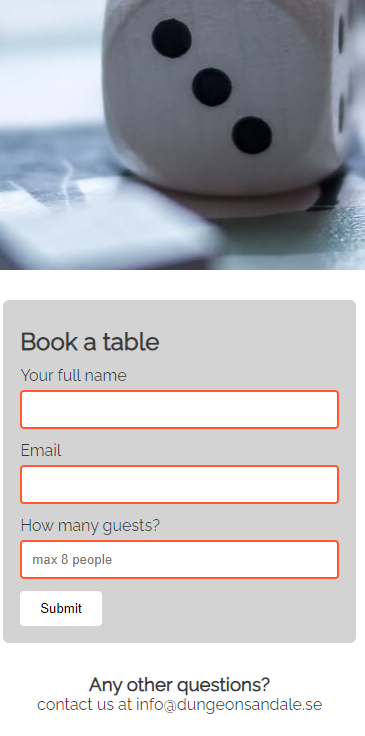

## Future features   
- A more detailed list of the games available, implemented in a gallery form with pictures of the games.
- Form or contact info for users to suggest games to add to the collection.  
- A menu page showing what drinks and food is available. 
- Form to sign up for the events, below the list of events.
- Adding an option to sign up for newsletter while booking a table. 
- A call to action and link to book a table on the home page, below the hero image. And a link to see the menu.

# Planning and design
The site was planned and designed according to the user stories and wireframes below. 
With images chosen to allude to board gaming, to be inviting to the potential users/customers. The color scheme of #ff5733 and #3a3a3a were chosen also to be inviting and warm. With the charcoal/black color to most text for good contrast and orange color for warmth and playfullness. 

The font chosen is Raleway from Google fonts, it was chosen as it is relatively simple and not to complex, but still conveying a feeling suitable with board games. Especially based on the way "W" is shaped, giving a hint of a medieval font, in line with the role playing theme in the bars name.  

Some changes were made to the original design in the wireframes, they are as follows.
- Contact page were changed to book a table, to simplify and clarify the purpose of the page. With advice from my mentor. 
- On the games page, the form for suggesting a game to add to the collection was removed. To be able to finish the project in time. The form for suggestion of games was added to future features instead. 
- The events are more vertically spread out on tablet and mobile screen size. 

### Wireframes
Home page 

Games page 

Book a table page 

# Technologies and languages used

### Languages
- The languages used are HTML5 and CSS.

### Technologies
- [Balsamiq](https://balsamiq.com/) was used to create the wireframes. 
- [Google Fonts](https://fonts.google.com/) was used for the fonts. The font used is Raleway. 
- [Fontawesome](https://fontawesome.com/) was used for icons. The logo in the header, social media icons in the footer. 
- [TinyPNG](https://tinypng.com/) was used to compress and optimize the images used. 
- Git was used as version control, by pushing the code via the Gitpod terminal. 
- [GitHub](https://github.com/) is used as a repository for the code. 

# Testing

### Validator testing

- HTML validator was run and small formatting errors were found and fixed. At final stage no errors or warnings on all three pages. 

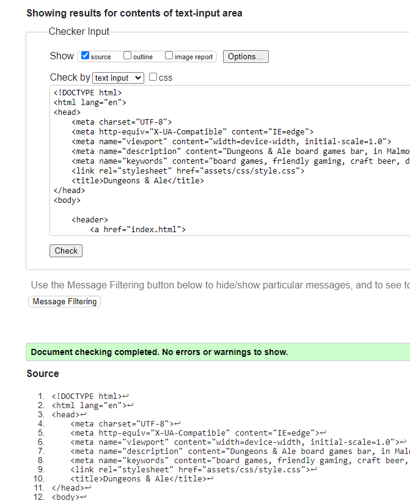

- CSS validator was run and no errors were found. Only a warning regarding the imported fonts from Google Fonts. 

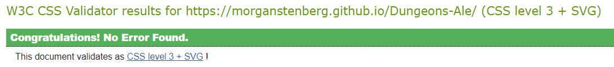

- Google Lighthouse for performance was used in the end of the project, to help identify performance issued. Especially the hero image on the home page was cropped to increase performance. 

### Manual testing

All the links on all pages have been checked and are in working order. As well as the form for booking a table. 

- Navigation links in navigation bar
- Footer - social media links 
- Header logo with link to home page
- Form input works correctly to CI form dump. 

The site and links have all been tested on different browsers

- Microsoft Edge version 116.0.1938.69 
- Chrome version 116.0.5845.179 
- Mozilla Firefox version 117.0

### Bugs

One was reported when a friend was helping out and testing the site externally, but it has not been possible to recreate it since. This was on a desktop with Chrome as browser. Image of it is included below. 
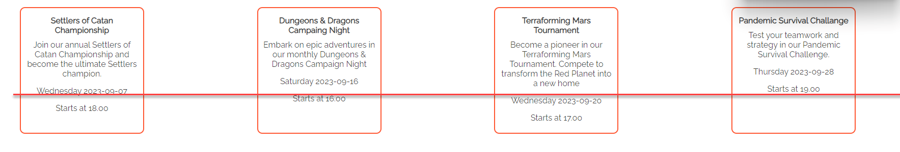

Otherwise no bugs have been found during building and testing of the site.  

# Deployment
The site was depoyed through GitHub pages. The steps taken to deply are as follows. 
- In the GitHub repository for the project, navigate to settings tab, then to pages on the left hand menu. 
- Select the main branch from the dropdown menu for branch. 
- Make sure that Deply from a branch is selected in the source menu.
- Click save and the page will be refreshed with a link to the live project. 

Live link to the project here - https://morganstenberg.github.io/Dungeons-Ale/

# Credits

### Photos 

Photos were taken from [Unsplash](https://unsplash.com/) and [Pixabay](https://pixabay.com/)
- [Hero image](https://unsplash.com/photos/X-A-LJVAhzk)
- [Games background image](https://pixabay.com/photos/board-game-play-strategy-fun-933165/)
- [Book a table background image](https://pixabay.com/photos/dice-game-pawn-board-game-chance-1264058/)

### Other

- Navbar with toggle dropdown menu - Coding Institute LMS Love Running Walkthrough Project 
- Form for booking a table - [W3 School How to form](https://www.w3schools.com/howto/howto_css_contact_form.asp)
- Positioning in general - [MDN CSS - Position](https://developer.mozilla.org/en-US/docs/Web/CSS/position)
- Flex shorthand - [MDN CSS - Flex](https://developer.mozilla.org/en-US/docs/Web/CSS/flex)

